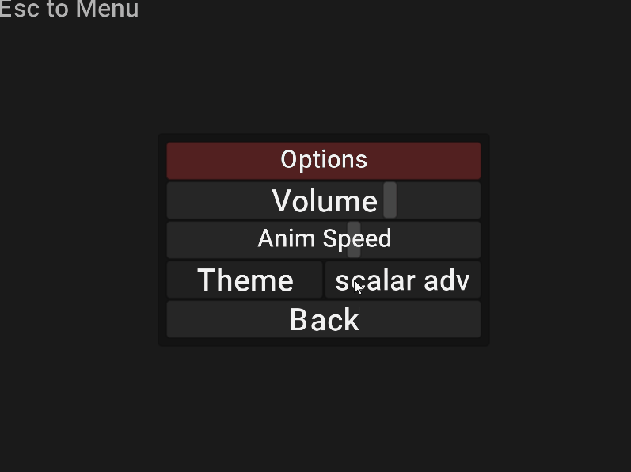

# ptt
A Pokemon Type-Trainer game to learn how types work in pokemon games.
In arcade mode, only accuracy is shown.
In Training mode, the correct advantage is hinted.

## description
Jai proof-of-concept simple game made *from scratch*. <br />
Main goal is to have a tiny (**<10 MB**) single executable game to show. <br />
## controls
<kbd>W</kbd> + <kbd>S</kbd> to select advantage <br />
<kbd>Space</kbd> to commit choice <br />
## build + run
You need to have a Jai compiler, git, git-lfs, SDL2 installed along with an OpenGL 3.3 compatible GPU
```console
apt-get install git git-lfs libsdl2-dev libsdl2-2.0-0 -y
git clone https://github.com/eliasvas/ptt
cd ptt/ && jai -quiet build.jai && ./.build/ptt
```